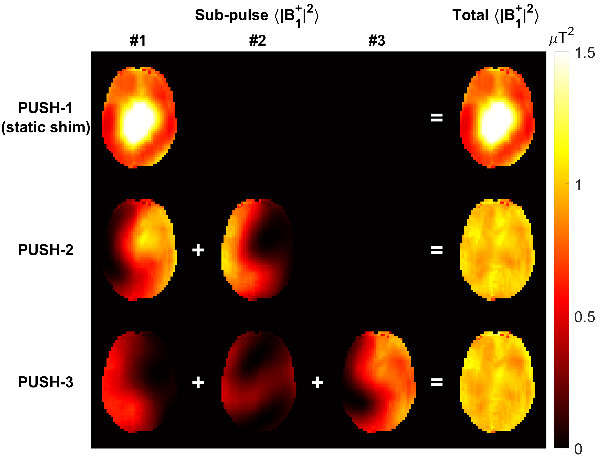

# PUlse design for Saturation Homogeneity (PUSH)

This repo contains the code necessary to reproduce the simulation results published in the paper "Parallel transmit PUlse design for Saturation Homogeneity (PUSH) for Magnetization Transfer imaging at 7T", submitted to MRM (link will be made available to a pre-print).

The script `PUSH_optimisation.m` optimises RF pulses for semisolid saturation which can be composed of several sub-pulses: 

_Mean squared B1 per sub-pulse for optimized PUSH pulses (PUSH-1, -2 and -3 in the columns, top to bottom, respectively). For >1 sub-pulse the patterns are highly complementary, yielding uniform mean squared B1._

The effect of those pulses can then be simulated with MTR maps using the script `simulate_MTR.m`. 
Separately, .mat files are provided as a release. Some of these can also be obtained by running `PUSH_optimisation.m` selecting the required ROIs. However, the .mat files containing TX maps, BET mask and data structure for the optimisation need to be downloaded from the release.

The lib folder contains auxiliary functions, as well as the [Colormaps Matlab package](https://uk.mathworks.com/matlabcentral/fileexchange/51986-perceptually-3uniform-colormaps) that provides different colormaps for plotting in Matlab.

This code is distributed under the MIT licence. If you find it useful, please cite the publication once available.

David Leitao. King's College London, November 2021. [@davidmcleitao](https://twitter.com/davidmcleitao)
